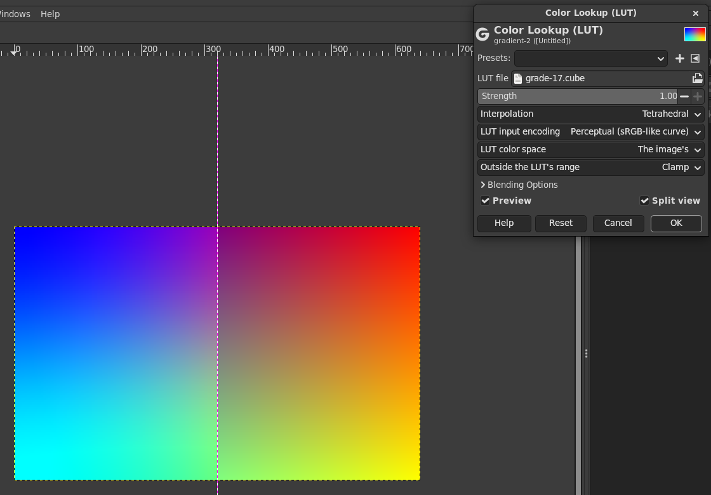
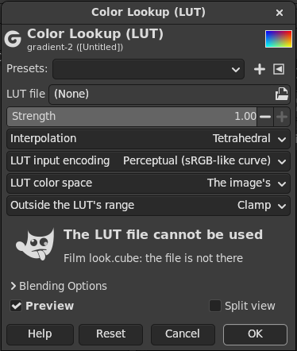

# gegl-lut

A color lookup filter for GIMP 3 (a GEGL operation, `lut:color-lookup`):
it applies 3D and 1D LUTs from `.cube`, `.3dl` and Hald CLUT files, the way
film looks and color grades are shared between Photoshop, Resolve,
Premiere, Lightroom and phone apps. It runs as a non-destructive filter:
Colors > Color Lookup (LUT)..., with on-canvas preview and split view,
editable later in the layer's effects and kept in XCF files.

## Why

GIMP 3.2 has no LUT filter. G'MIC's "Apply External CLUT" works but is
destructive and lives in G'MIC's own dialog. GEGL has no LUT operation
either (checked in GEGL master, its workshop included, and in the 472
operations of the GIMP 3.2.6 Flatpak), and GIMP issue
[#15505](https://gitlab.gnome.org/GNOME/gimp/-/work_items/15505), the
checklist for importing PSD adjustment layers as GEGL filters, lists Color
Look-up as "Not sure what the equivalent GEGL filter(s) would be". This
operation is that equivalent. It is LGPL-3.0-or-later, like GEGL, so that
it can be offered upstream (as `gegl:color-lookup`).

## Using it in GIMP

Colors > Color Lookup (LUT)... opens the dialog:

- **LUT file**: a `.cube`, `.3dl`, or a Hald CLUT image (PNG, TIFF).
- **Strength**: 0 leaves the image as it is, 1 applies the LUT fully; in
  between it mixes the two, in the encoding the LUT expects.
- **Interpolation**: tetrahedral (the default, as in most grading
  software) or trilinear, for 3D LUTs. 1D LUTs are interpolated linearly.
- **LUT input encoding**: perceptual (the image's sRGB-like curve, the
  default) or linear light. Most creative LUTs are made for display
  referred Rec. 709 or sRGB values, which is the perceptual encoding.
- **LUT color space**: the image's (the default) or sRGB. See below.
- **Outside the LUT's range**: clamp values to the edge of the LUT's input
  range (the default), or extend the LUT linearly beyond it.

The filter works on any image precision; it converts the pixels to the
encoding and space the LUT needs and back, and leaves alpha untouched.
If the file cannot be used, the image is left as it is and the dialog
says why:

A LUT file is read once and kept (by path, modification time and size),
so the preview is fast. When you edit a LUT file while GIMP is open, the
filter uses the new version when it next renders, for example when you
change a setting or open the filter again.

### Where to get LUTs

Many free LUT packs exist, for example the Hald CLUT film simulation
collection linked from RawTherapee's
[Film Simulation](https://rawpedia.rawtherapee.com/Film_Simulation) page,
the CLUTs of [G'MIC](https://gmic.eu), and packs from camera makers for
their log profiles. Each pack has its own licence and terms (some are free
for personal use only, some need attribution); read them before you share
the LUTs or images made with them. This repository contains only LUTs
made for its tests.

## Color spaces

A LUT is a table of numbers, made for one color space and one encoding;
the file does not say which. What the filter does with an image in another
space:

- **LUT color space: the image's** applies the table to the image's own
  values, in the image's color space and with its curve. That is what
  Photoshop's Color Lookup does, and what PSD import needs. For an sRGB
  image (the usual case) it is exactly right for an sRGB or Rec. 709 LUT.
  For an image in a wider space (Adobe RGB, Rec. 2020, ProPhoto), a LUT
  made for sRGB then gives more saturated colors than its maker saw.
- **LUT color space: sRGB** converts the image to sRGB for the LUT and
  back (babl does the conversions). The LUT sees what it was made for.
  Colors outside sRGB become values below 0 or above 1, which the LUT
  clamps unless "Outside the LUT's range" is set to extrapolate; with
  extrapolation a LUT near the identity keeps them.
- **Perceptual** means the curve of the chosen space: the sRGB curve for
  sRGB, gamma 2.2 for Adobe RGB. For an image whose profile has a linear
  curve, perceptual is linear too; choose LUT color space sRGB for a LUT
  made for sRGB values.

The operation chooses babl formats (`R'G'B'A float` or `RGBA float`, in
the image's space or in sRGB) and lets babl convert, rather than applying
transfer curves itself. LUTs for log footage (S-Log, LogC, V-Log) expect
camera log values, which photos do not have; they are for video.

## Formats

- **Adobe / Iridas `.cube`** (Cube LUT Specification 1.0): `LUT_3D_SIZE`
  2 to 256, `LUT_1D_SIZE` 2 to 65536, `DOMAIN_MIN`, `DOMAIN_MAX`, `TITLE`,
  comments, blank lines, Windows and old Mac line ends, keywords in any
  case, numbers read the same in every locale.
- **Resolve `.cube`**: `LUT_1D_INPUT_RANGE`, `LUT_3D_INPUT_RANGE`, and a 1D
  "shaper" LUT followed by a 3D LUT in one file (the 1D table first, as
  Blackmagic describes it). Other programs' keywords are ignored.
- **Autodesk `.3dl`** (Flame and Lustre): whole numbers; the first line
  is the input grid (for example `0 64 128 ... 1023`); then the table with
  blue changing fastest. The output bit depth comes from Lustre's
  `Mesh <input bits> <output bits>` line, or else, as OpenColorIO does it,
  from the largest value (up to 511 is 8 bits, up to 2047 is 10 bits, up
  to 8191 is 12 bits, more is 16 bits). A grid within 2 codes of even
  spacing is taken as even; an uneven grid places the points at its input
  values. `3DMESH`, `LUT8` and `gamma` lines are read and skipped.
- **Hald CLUT images**: level L is an image of L^3 x L^3 pixels holding a
  cube of L^2 points per axis, red changing fastest in raster order, as
  G'MIC, RawTherapee, darktable, ImageMagick and FFmpeg use them; levels 2
  to 16, 8 or 16 bit PNG and TIFF (float too; these are tested). JPEG,
  WebP and EXR files go to GEGL's loaders too, but are not tested. The
  values are taken as they are in the file.

A file that is missing, empty, not a LUT, damaged or cut short, has the
wrong number of lines, numbers that are not numbers (or not finite, or
beyond 10^6), sizes out of range or an empty input range leaves the
image as it is, with one warning per version of the file and the reason
in the dialog. Values of the image that are NaN or infinite give finite
results.

## Building and installing

Needs meson, ninja, a C compiler and the GEGL development files (0.4.62 or
newer).

    meson setup build -Dmoduledir=$HOME/.local/share/gegl-0.4/plug-ins
    ninja -C build install

For the Flatpak version of GIMP, build inside it with
[gimp-devtools](https://github.com/sandbranch/gimp-devtools),
which installs into `~/.var/app/org.gimp.GIMP/data/gegl-0.4/plug-ins`:

    gimp-build.sh . meson setup build -Dmoduledir=\$GEGL_OPDIR
    gimp-build.sh . ninja -C build install

Restart GIMP after installing. On the command line:

    gegl photo.jpg -o graded.jpg -- lut:color-lookup path=look.cube strength=0.8

## Tests

All of them need no network or display, and generate their LUT files
(`tests/fixtures` holds a few small ones made for the tests).

- `tests/check.sh`: 205 pass/fail checks (`tests/check.c`), built and run
  twice in the Flatpak SDK, as usual and with AddressSanitizer and UBSan
  (with leak checks of this code). Identities of 2 to 65 points in
  `.cube`, `.3dl` and Hald CLUTs; affine transforms, which interpolation
  must reproduce exactly; a gamma curve (linear between the points and
  within h^2/8 max|f''| of the curve); products of channels, exact for
  trilinear and with the predicted h^2 min (fa, fb) for tetrahedral;
  a colorful grade against a reference interpolation in double
  precision; 1D LUTs; input ranges; values outside the range, NaN and
  infinities; alpha; strength; the encoding and color space options
  against babl and the sRGB formulas; 44 bad files; the cache; 8 bit,
  gray and RGB images; the fixtures. `tests/check.sh quick` skips the
  sanitizer build.
- `tests/gimp-check.sh`: the filter in the Flatpak GIMP without a window
  (a throwaway profile in `tests/output`): on float, linear and 8 bit
  images, through an XCF save and load, against plain GEGL and against
  the `gegl` command line.
- `tests/crosscheck.sh`: against FFmpeg's `lut3d`, `haldclut` and `lut1d`
  filters (needs ffmpeg and numpy): the largest difference is 1.8e-7.
- `tests/bench.sh`: times on a 24 megapixel image.

## Speed

On a Ryzen 9 5900X (12 cores, 24 threads), a 6000 x 4000 image, GIMP's
Flatpak GEGL 0.4.72:

| | 24 threads, float | 24 threads, 8 bit | 1 thread, float |
|---|---|---|---|
| 33 points, tetrahedral | 0.038 s | 0.18 s | 0.34 s |
| 33 points, trilinear | 0.044 s | 0.19 s | 0.45 s |
| 65 points, tetrahedral | 0.040 s | 0.19 s | 0.34 s |
| 65 points, trilinear | 0.043 s | 0.19 s | 0.45 s |

For 8 bit images the time is GEGL's conversion to float and back
(gegl:levels takes the same). Reading a `.cube` takes 0.012 s for 33
points and 0.061 s for 65; from the cache 0.00002 s. The table size hardly
matters: the loop has no branches, and its lookups are gathers, which the
compiler cannot vectorise for the base x86-64 instruction set.

## License

LGPL version 3 or later, see COPYING.LESSER and COPYING.
